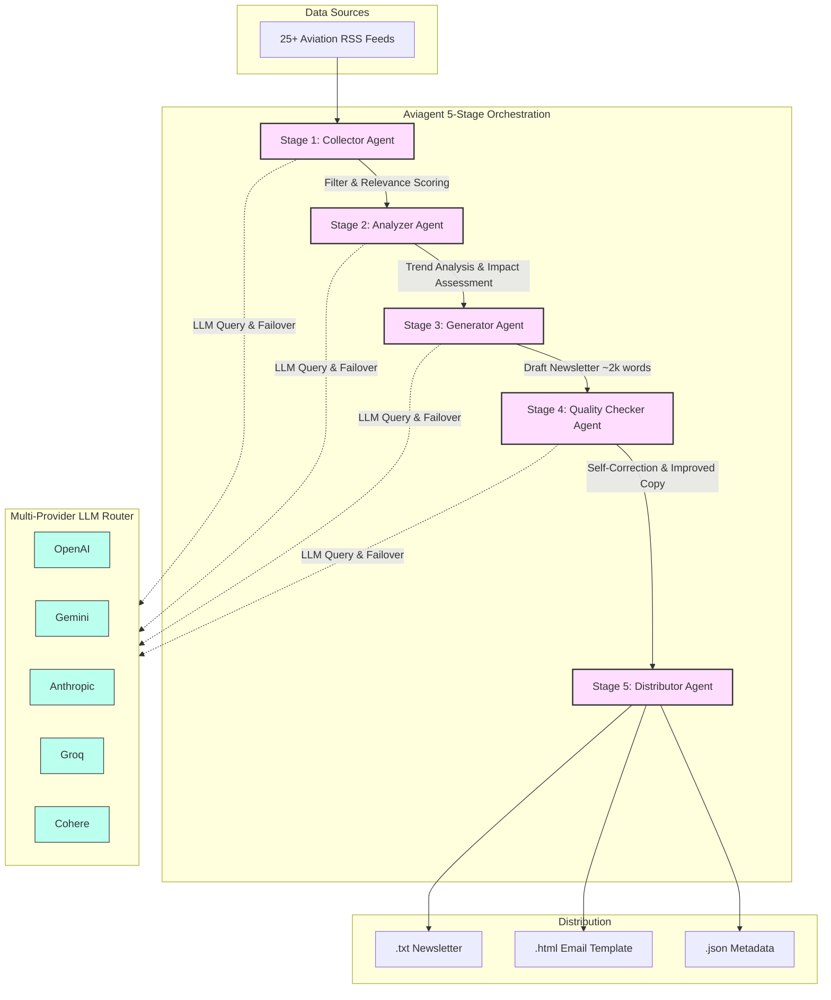

# I built an AI agent that writes my aviation newsletter
*By Nagarjuna C | AI Innovation, Multi-Agent Systems*

---

### Introduction

I'm an aviation enthusiast who was manually reading 10+ news sites every week to stay up to date. I decided to automate it — not with a scraper or a prompt, but with a proper 5-stage AI pipeline. The result is **Aviagent**, an open-source Python tool anyone can run locally in 5 minutes.

---

### What It Does

Each run executes five LLM-powered agents in sequence:

1. **Collector** — Fetches real articles from 25 aviation RSS feeds (Simple Flying, Aviation Week, The Aviationist, and more). Each article is scored for relevance by the LLM before passing forward.
2. **Analyzer** — Identifies 3–5 major industry trends across the collected articles, ranks the top stories, and assesses business impact.
3. **Generator** — Writes a professional ~1,500–2,500 word newsletter with an executive summary, trend deep-dives, and article highlights.
4. **Quality Checker** — A second LLM pass reviews the draft for inaccuracies and clarity, returns an improved version with a confidence score.
5. **Distributor** — Wraps everything in a styled HTML email template with a persistent issue number and saves to .txt, .html, and .json.

---

### Why I Built It This Way

* **Multi-provider support** — Works with OpenAI, Gemini, Groq, Anthropic, Cohere. Free tiers (Gemini, Groq) make it zero-cost for hobby use.
* **Automatic fallback** — If one provider hits a rate limit, it retries with exponential backoff and cascades to the next available model.
* **No hardcoded dependencies** — All sources live in sources.json, easy to add or disable without touching code.
* **Security-conscious** — SSRF protection blocks private IP ranges so the collector can't be abused to hit internal hosts.

---

### Get It

Feel free to check out, clone or contribute to the project on GitHub:

👉 [github.com/Nagarc/Aviagent](https://github.com/Nagarc/Aviagent)
